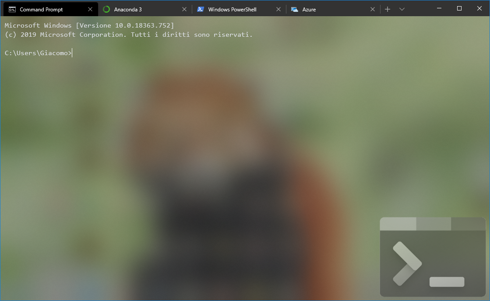

# Themed Windows Terminal

Is a simple theme for the new [Windows Terminal](https://www.microsoft.com/en-us/p/windows-terminal-preview/9n0dx20hk701)!

It contains few color themes and some logos.

Actually Terminals provided:

* Good old "Command Prompt" style for the standard Command Prompt Terminal
* A [PowerShell](https://en.wikipedia.org/wiki/PowerShell) style for the PowerShell Terminal
* An [Anaconda](https://www.anaconda.com/) style for the Anaconda/Python Terminal
* An [Azure Cloud Shell](https://azure.microsoft.com/en-us/features/cloud-shell/) style for the Azure Cloud Shell Terminal

## Example



## Color themes provided

### Default colors provided by [Microsoft](https://github.com/microsoft/terminal/blob/master/src/cascadia/TerminalApp/defaults.json):

* Campbell
* Campbell Powershell
* One Half Dark
* One Half Light
* Solarized Dark
* Solarized Light
* Tango Dark
* Tango Light
* Vintage

### Additional colors theme provided

* [Dracula](https://github.com/dracula/windows-terminal)

### Color usage

* The Command Prompt Terminal uses the `One Half Dark` theme
* The PowerShell Prompt Terminal uses the `Campbell PowerShell` theme
* The Anaconda Prompt Terminal uses the `Dracula` theme
* The Azure Cloud Shell Prompt Terminal uses the `Campbell` theme

## Install procedure

Copy the file/folder located in the `ThemedWindowsTerminal` folder of the repo to the folder `%LOCALAPPDATA%\Packages\Microsoft.WindowsTerminal_8wekyb3d8bbwe` on your system.

And you are done!

## Functionality

Over the aesthetical changes some additional functionalities are provided.

| Key shortcut | Description |
| ------------ | ----------- |
| <kbd>Ctrl</kbd> + <kbd>T</kbd> | Create a new tab |
| <kbd>Ctrl</kbd> + <kbd>W</kbd> | Close the actual tab |
| <kbd>Ctrl</kbd> + <kbd>Tab</kbd> | Switch to the next tab |
| <kbd>Ctrl</kbd> + <kbd>Shift</kbd> + <kbd>Tab</kbd> | Switch to the previous tab |
| <kbd>Ctrl</kbd> + <kbd>,</kbd> | Open the `settings.json` directly |
| <kbd>Ctrl</kbd> + <kbd>Shift</kbd> + <kbd>1</kbd> | Open a new "Command Prompt" tab |
| <kbd>Ctrl</kbd> + <kbd>Shift</kbd> + <kbd>2</kbd> | Open a new "Anaconda" tab |
| <kbd>Ctrl</kbd> + <kbd>Shift</kbd> + <kbd>3</kbd> | Open a new "PowerShell" tab |
| <kbd>Ctrl</kbd> + <kbd>Shift</kbd> + <kbd>4</kbd> | Open a new "Azure Cloud Shell" tab |
| <kbd>Ctrl</kbd> + <kbd>Shift</kbd> + <kbd>Up</kbd> | Scroll Up |
| <kbd>Ctrl</kbd> + <kbd>Shift</kbd> + <kbd>Down</kbd> | Scroll Down |
| <kbd>Ctrl</kbd> + <kbd>Shift</kbd> + <kbd>PgUp</kbd> | Scroll Up a page |
| <kbd>Ctrl</kbd> + <kbd>Shift</kbd> + <kbd>PgDown</kbd> | Scroll Down a page |
| <kbd>Ctrl</kbd> + <kbd>Shift</kbd> + <kbd>F</kbd> | Open Search Box |
| <kbd>Ctrl</kbd> + <kbd>=</kbd> | Increase the font size by 1 |
| <kbd>Ctrl</kbd> + <kbd>-</kbd> | Decrease the font size by 1 |
| <kbd>Ctrl</kbd> + <kbd>0</kbd> | Reset font size |
| <kbd>Alt</kbd> + <kbd>1</kbd> | Switch to tab 1 |
| <kbd>Alt</kbd> + <kbd>2</kbd> | Switch to tab 2 |
| <kbd>Alt</kbd> + <kbd>3</kbd> | Switch to tab 3 |
| <kbd>Alt</kbd> + <kbd>4</kbd> | Switch to tab 4 |
| <kbd>Alt</kbd> + <kbd>5</kbd> | Switch to tab 5 |
| <kbd>Alt</kbd> + <kbd>6</kbd> | Switch to tab 6 |
| <kbd>Alt</kbd> + <kbd>7</kbd> | Switch to tab 7 |
| <kbd>Alt</kbd> + <kbd>8</kbd> | Switch to tab 8 |
| <kbd>Alt</kbd> + <kbd>9</kbd> | Switch to tab 9 |

### Copy on selection
Selections are automatically copied to your clipboard.

## Tweak

If you have an Anaconda instance on your machine, could be need to update the file `settings.json` in `LocalState` folder because Anaconda can be installed per user or for all the users on the system. By default the script act with a "per user" approach, if needed just open the `settings.json` and update the path to match your system setup.

```json
// Anaconda installed "Just for me"
"commandline": "cmd.exe /k %HOMEPATH%\\Anaconda3\\Scripts\\activate.bat",
// Anaconda installed for "All users"
//"commandline": "cmd.exe /k C:\\ProgramData\\Anaconda3\\Scripts\\activate.bat",
```

## Additional resources

[Official Microsoft Theming guide](https://github.com/microsoft/terminal/blob/master/doc/cascadia/SettingsSchema.md)

## License
The `settings.json` file is licensed under the [CC0 1.0 Universal](./LICENSE) .

All the artwork copyright are of their original authors.

### Logos original location

* [Command Prompt logo](https://choco.sage.edu/packages/microsoft-windows-terminal)
* [PowerShell logo](https://en.wikipedia.org/wiki/PowerShell#/media/File:PowerShell_5.0_icon.png)
* [Anaconda logo](https://www.pngitem.com/middle/ioiwbRx_anaconda-python-icon-hd-png-download/)
* [Azure Cloud Shell Logo](https://www.jpaul.me/2019/05/azure-automation-how-to-quickly-work-with-many-subscriptions/) 
